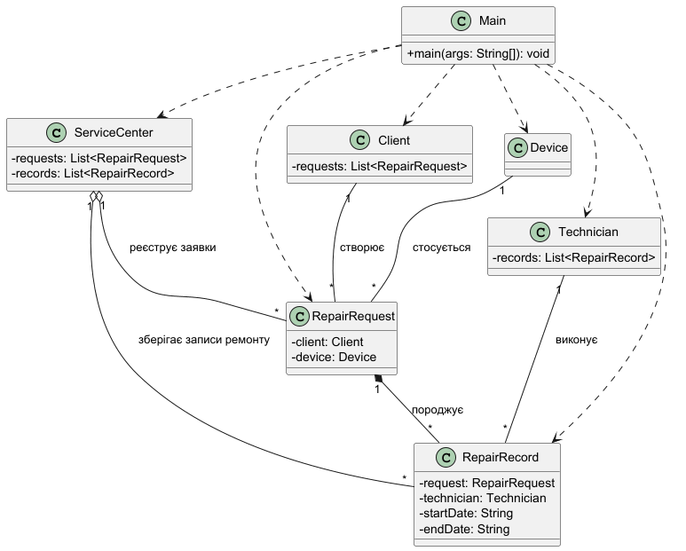

# Лабораторна робота №2

### Варіант №6
Реєстрація заявок на ремонт техніки

---

## Опис роботи

У роботі виконано уточнення моделі предметної області та побудовано UML-діаграму класів.

Створено класи:
- ServiceCenter
- Client
- Device
- Technician
- RepairRequest
- RepairRecord
- Main

Реалізовано зв’язки між класами відповідно до UML-діаграми.

---

## UML-діаграма

