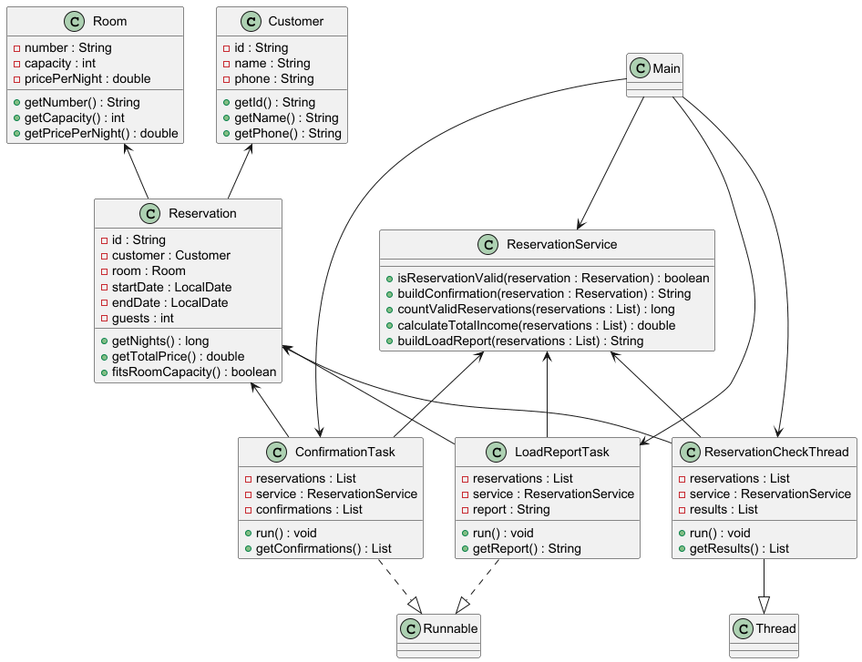
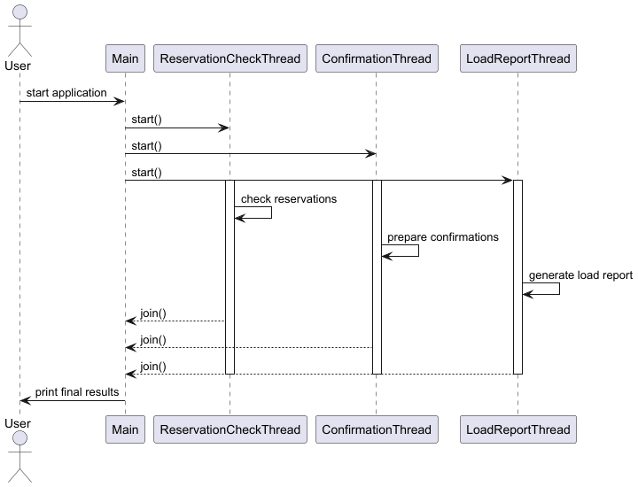

# Лабораторна робота №14

### Варіант №6
Система бронювання

---

## Опис роботи

У роботі реалізовано консольний Java-застосунок для демонстрації базової багатопотоковості в Java.

Програма:
- створює та запускає кілька потоків;
- демонструє роботу `Thread` і `Runnable`;
- виконує паралельну перевірку бронювань;
- формує підтвердження бронювання;
- генерує звіт про завантаження системи;
- використовує `start()`, `sleep()` і `join()`;
- виводить інформацію про роботу потоків у консоль;
- виконує модульне тестування детермінованої логіки.

---

## Створені класи

### Предметна область
- Customer
- Room
- Reservation

### Service
- ReservationService

### Threads
- ReservationCheckThread
- ConfirmationTask
- LoadReportTask

### Demo
- Main

### Test
- ReservationServiceTest

---

## Приклад роботи програми

```text
Main: starting threads

Reservation-Check-Thread: checked R001
Confirmation-Thread: prepared confirmation for R001
Load-Report-Thread: starting load report generation

Main: all threads completed
```

---

## UML-діаграма класів



---

## UML-діаграма сценарію потоків

