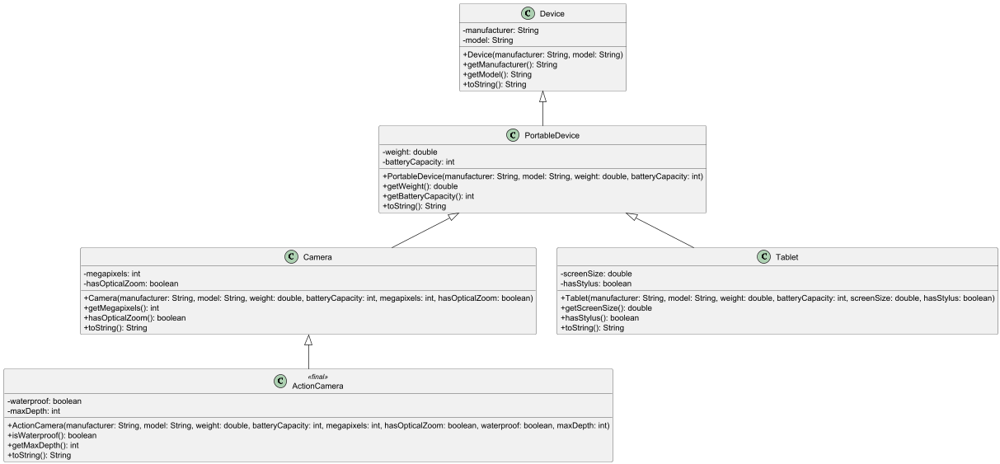

# Лабораторна робота №5

### Варіант №6
Прокат техніки

---

## Опис роботи

У роботі побудовано ієрархію класів глибиною 4 рівні без використання абстрактних класів та інтерфейсів.

Створено класи:
- ActionCamera
- Camera
- Device
- PortableDevice
- Tablet

Також реалізовано демонстраційні класи для перевірки роботи ієрархії:
- Lab05JolDemo
- Main
- DeviceTest
- InheritanceTest

---

## UML-діаграма

---

## JOL-аналіз

Виконано аналіз внутрішньої структури об’єкта класу `ActionCamera` за допомогою бібліотеки JOL.

Результати показали, що об’єкт підкласу містить усі поля батьківських класів в єдиній області пам’яті.

Файл з результатами:
`lab05/docs/jol-action-camera.txt`

---

## Аналіз моделі з ЛР №2

У моделі лабораторної роботи №2 класи (Client, Device, Technician, RepairRequest) не мають відношення "є різновидом", оскільки описують різні сутності предметної області.

Тому використання наслідування між ними є некоректним. У такому випадку доцільно використовувати асоціації між класами.