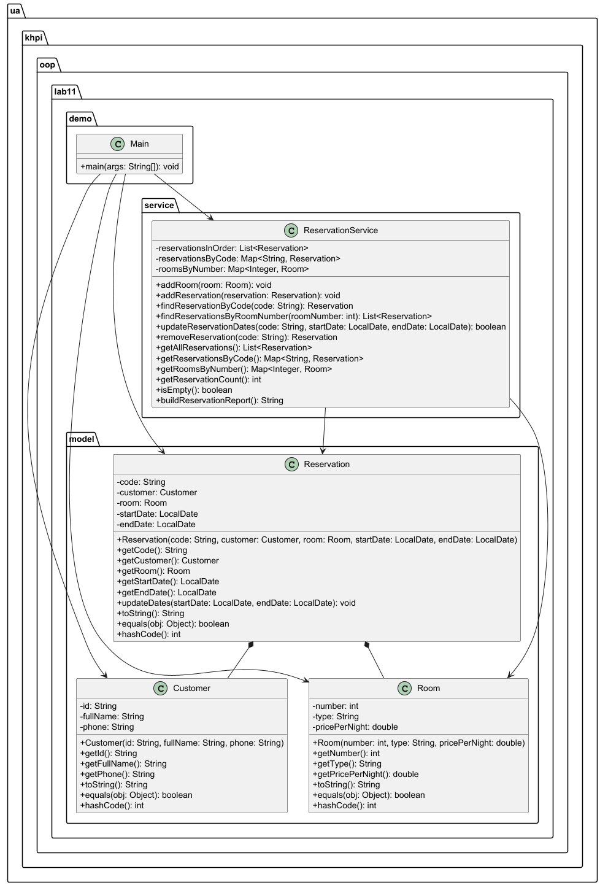

# Лабораторна робота №11

### Варіант №6
Система бронювання

---

## Опис роботи

У роботі реалізовано консольний Java-застосунок для роботи зі стандартними колекціями Java Collections Framework.

Створено класи предметної області:
- Customer;
- Room;
- Reservation;

Також реалізовано сервісний клас:
- ReservationService;

У роботі використано стандартні колекції:
- ArrayList;
- LinkedHashMap;

Реалізовані операції:
- додавання бронювання;
- пошук бронювання;
- оновлення даних бронювання;
- видалення бронювання;
- перегляд усіх бронювань;
- генерація звіту через entrySet();

Також створено:
- Main — демонстраційна програма;
- ReservationServiceTest — модульні тести;

---

## UML-діаграма

---

## Тестування

У модульних тестах перевірено:
- початковий стан колекцій;
- додавання бронювань;
- заборону дублювання кодів;
- пошук бронювань;
- оновлення дат бронювання;
- видалення бронювань;
- порядок елементів у колекції;
- незмінність колекцій, що повертаються назовні.