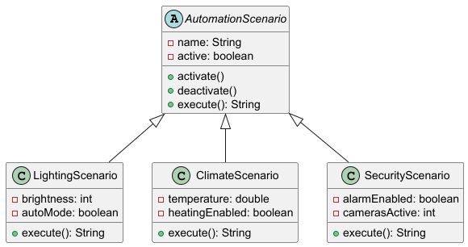

# Лабораторна робота №6

### Варіант №6
Сценарії автоматизації розумного будинку

---

## Опис роботи

У роботі побудовано поліморфну модель з використанням абстрактного класу як узагальненого типу.

Створено абстрактний базовий клас:
- AutomationScenario

Реалізовано підкласи:
- LightingScenario
- ClimateScenario
- SecurityScenario

Створено тестові класи:
- AutomationScenarioPolymorphismTest
- LightingScenarioTest

Тести перевіряють:
- поліморфний виклик методу `execute()`
- коректність роботи сценарію освітлення

Поліморфізм реалізовано у класі `Main`, де створюється масив типу `AutomationScenario[]`, що містить об’єкти різних підкласів.

При виклику методу `execute()` через базовий тип виконується відповідна реалізація кожного підкласу.

---

## UML-діаграма

