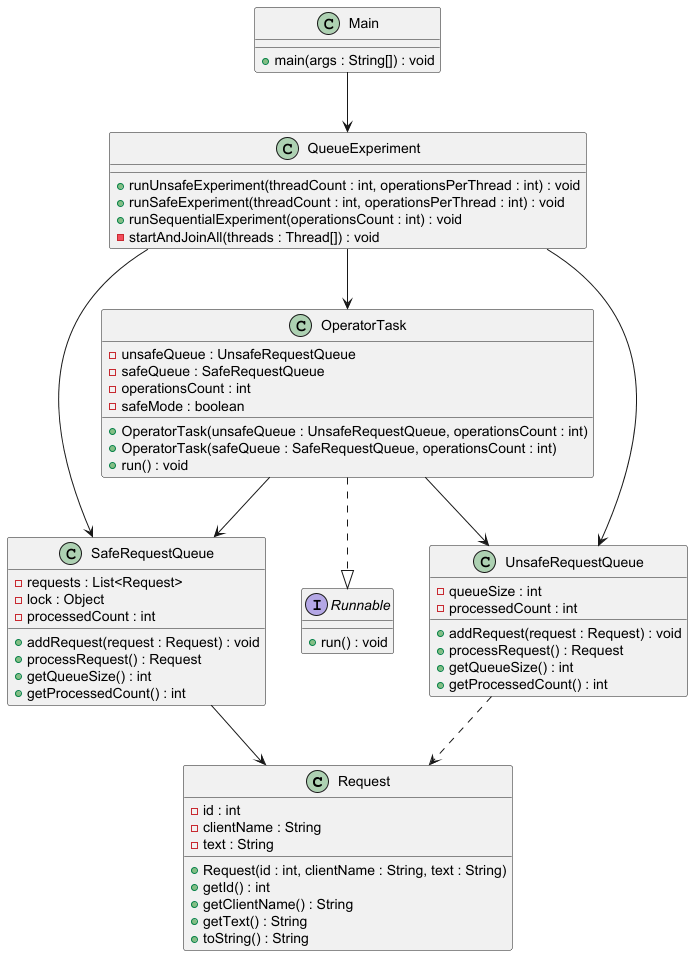
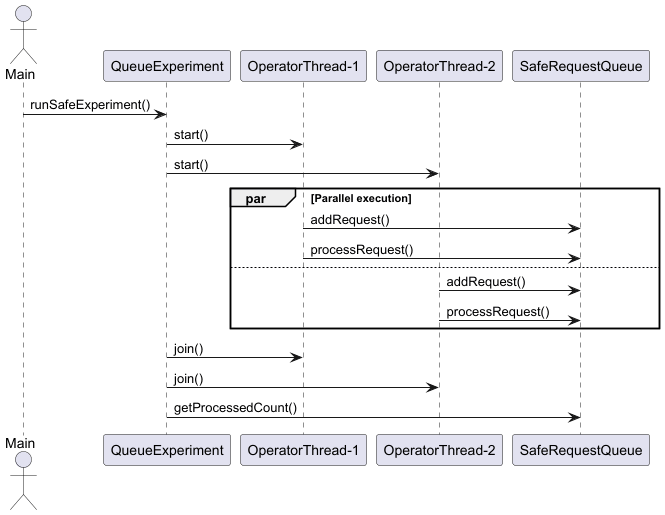

# Лабораторна робота №15

### Варіант №6
Черга звернень

---

## Опис роботи

У роботі реалізовано консольний Java-застосунок для демонстрації синхронізації потоків у Java.

Програма:
- створює кілька потоків, які одночасно працюють зі спільною чергою звернень;
- демонструє проблему race condition без синхронізації;
- реалізує потокобезпечний доступ за допомогою `synchronized`;
- використовує критичні секції та монітор блокування;
- виконує паралельну обробку звернень;
- використовує `Thread`, `Runnable`, `start()` і `join()`;
- порівнює небезпечний і синхронізований варіанти роботи;
- вимірює час виконання послідовного та паралельного сценаріїв;
- виконує модульне тестування логіки спільного ресурсу.

---

## Створені класи

### Предметна область
- Request

### Shared Resource
- UnsafeRequestQueue
- SafeRequestQueue

### Threads
- OperatorTask

### Service
- QueueExperiment

### Demo
- Main

### Test
- RequestQueueTest

---

## Приклад роботи програми

```text
=== Unsafe request queue ===
Threads: 4
Operations per thread: 100000
Expected processed requests: 400000
Actual processed requests: 263108
Final queue size: 5122

=== Safe request queue ===
Threads: 4
Operations per thread: 100000
Expected processed requests: 400000
Actual processed requests: 400000
Final queue size: 0

=== Sequential request queue ===
Operations: 400000
Expected processed requests: 400000
Actual processed requests: 400000
Final queue size: 0
```

---

## UML-діаграма класів



---

## UML-діаграма сценарію потоків

