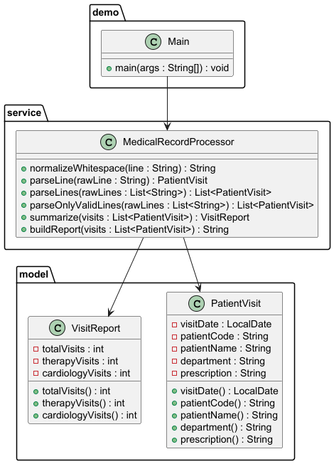

# Лабораторна робота №13

### Варіант №6
Медичні записи

---

## Опис роботи

У роботі реалізовано консольний Java-застосунок для обробки текстових медичних записів із використанням регулярних виразів.

Програма:
- зчитує дані з текстового файлу;
- виконує нормалізацію тексту;
- перевіряє формат записів;
- вилучає дані за допомогою регулярних виразів;
- перетворює текстові записи на об’єкти;
- формує підсумковий звіт;
- виконує статистичний аналіз записів.

---

## Створені класи

### model
- PatientVisit
- VisitReport

### service
- MedicalRecordProcessor

### demo
- Main

### test
- MedicalRecordProcessorTest

---

## Приклад вхідного запису

```text
2026-04-10 | PAT-001 | Ivan Petrenko | Therapy | Aspirin 100mg
```

---

## UML-діаграма

