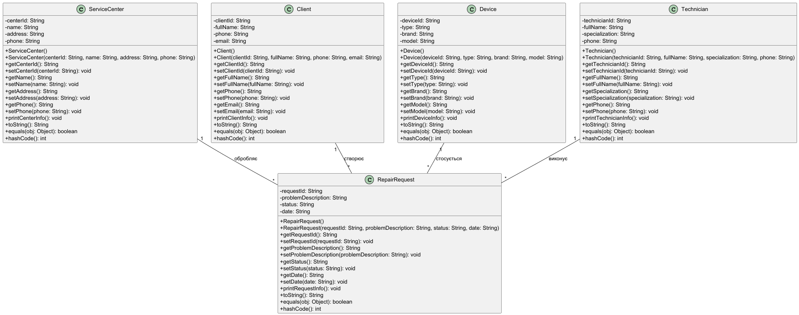

# Лабораторна робота №1

### Варіант №6
Реєстрація заявок на ремонт техніки

---

## Опис роботи

У роботі реалізовано простий застосунок для моделювання системи реєстрації заявок на ремонт техніки.

Створено класи:
- ServiceCenter
- Client
- Device
- Technician
- RepairRequest
- Main

Класи містять поля, конструктори та методи виводу інформації.

---

## UML-діаграма

